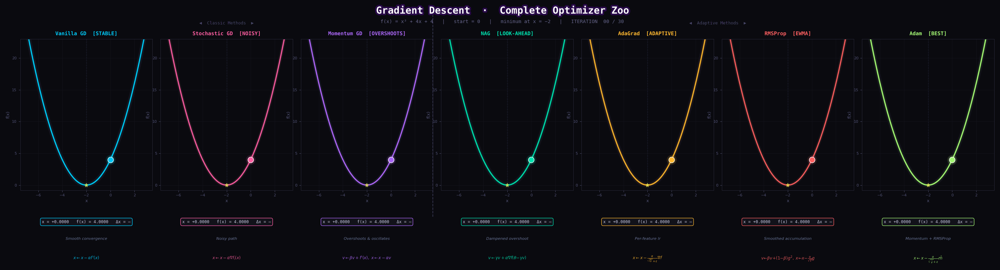

# Gradient Descent — From Scratch to Adaptive

---

## What's Inside

| Notebook | Topic |
|---|---|
| `Gradient_descent.ipynb` | Vanilla GD · Stochastic GD · Momentum GD |
| `Adaptive_GD_Techniques.ipynb` | NAG · AdaGrad · RMSProp · Adam |
| `Feature_Scaling.ipynb` | Min-Max · Standardization · Robust Scaling |

---

## The Optimizers

All algorithms minimize **f(x) = x² + 4x + 4**, whose gradient is **f′(x) = 2x + 4**, with minimum at **x = −2**.

---

### 1 · Vanilla Gradient Descent

The baseline. Steps straight down the gradient every iteration.

$$x \leftarrow x - \alpha \cdot f'(x)$$

| Symbol | Meaning |
|---|---|
| $\alpha$ | learning rate |
| $f'(x)$ | gradient at current point |

**Behaviour:** smooth, predictable convergence — but slow on flat regions.

---

### 2 · Stochastic Gradient Descent (SGD)

Uses a **single random sample** per update instead of the full dataset.

$$x \leftarrow x - \alpha \cdot \nabla f_i(x)$$

| Symbol | Meaning |
|---|---|
| $\nabla f_i(x)$ | gradient from one random sample $i$ |

**Behaviour:** noisy path, but escapes local minima more easily and scales to large datasets.

---

### 3 · Momentum GD

Accumulates a velocity term to push through flat or noisy regions.

$$v \leftarrow \beta v + f'(x)$$
$$x \leftarrow x - \alpha v$$

| Symbol | Meaning |
|---|---|
| $v$ | velocity (exponential average of past gradients) |
| $\beta$ | momentum coefficient (typically 0.9) |

**Behaviour:** faster descent, but **overshoots** the minimum and oscillates around it.

---

### 4 · Nesterov Accelerated Gradient (NAG)

Fixes Momentum's overshoot by peeking ahead before computing the gradient.

$$v \leftarrow \gamma v + \alpha \cdot \nabla f(\theta - \gamma v)$$
$$\theta \leftarrow \theta - v$$

| Symbol | Meaning |
|---|---|
| $\gamma$ | momentum factor |
| $\theta - \gamma v$ | look-ahead position |

**Behaviour:** same speed as Momentum but **dampens overshoot** by correcting before it happens.

---

### 5 · AdaGrad

Assigns each parameter its own learning rate — features with sparse gradients get larger updates.

$$G \leftarrow G + \left(f'(x)\right)^2$$
$$x \leftarrow x - \frac{\alpha}{\sqrt{G} + \epsilon} \cdot f'(x)$$

| Symbol | Meaning |
|---|---|
| $G$ | accumulated sum of squared gradients |
| $\epsilon$ | small constant for numerical stability |

**Behaviour:** great for sparse data; learning rate decays aggressively and can **stall** before convergence.

---

### 6 · RMSProp

Replaces AdaGrad's sum with an **exponential moving average** to prevent the learning rate from decaying to zero.

$$v \leftarrow \beta v + (1 - \beta)\left(f'(x)\right)^2$$
$$x \leftarrow x - \frac{\alpha}{\sqrt{v} + \epsilon} \cdot f'(x)$$

| Symbol | Meaning |
|---|---|
| $v$ | exponential moving average of squared gradients |
| $\beta$ | decay rate (typically 0.9) |

**Behaviour:** steady, self-regulated step sizes — works well on non-stationary problems.

---

### 7 · Adam (Adaptive Moment Estimation)

Combines **Momentum** (first moment) and **RMSProp** (second moment), with bias correction in early iterations.

$$m \leftarrow \beta_1 m + (1 - \beta_1) f'(x) \quad \text{(momentum)}$$
$$v \leftarrow \beta_2 v + (1 - \beta_2) \left(f'(x)\right)^2 \quad \text{(RMSProp)}$$
$$\hat{m} = \frac{m}{1 - \beta_1^t}, \quad \hat{v} = \frac{v}{1 - \beta_2^t} \quad \text{(bias correction)}$$
$$x \leftarrow x - \frac{\alpha}{\sqrt{\hat{v}} + \epsilon} \cdot \hat{m}$$

| Symbol | Meaning |
|---|---|
| $m$ | first moment (mean of gradients) |
| $v$ | second moment (variance of gradients) |
| $\beta_1$ | momentum decay (typically 0.9) |
| $\beta_2$ | RMSProp decay (typically 0.999) |
| $t$ | current timestep |

**Behaviour:** fast, stable, and robust — the default choice for most deep learning tasks.

---

## Feature Scaling

Applied before gradient descent to ensure all features contribute equally.

| Method | Formula | Best for |
|---|---|---|
| **Min-Max** | $x' = \dfrac{x - x_{\min}}{x_{\max} - x_{\min}}$ | bounded, no outliers |
| **Standardization** | $x' = \dfrac{x - \mu}{\sigma}$ | Gaussian-like data |
| **Robust** | $x' = \dfrac{x - \text{median}}{\text{IQR}}$ | data with outliers |

Each method is implemented in **NumPy · scikit-learn · PyTorch · TensorFlow**.

---

## Results

